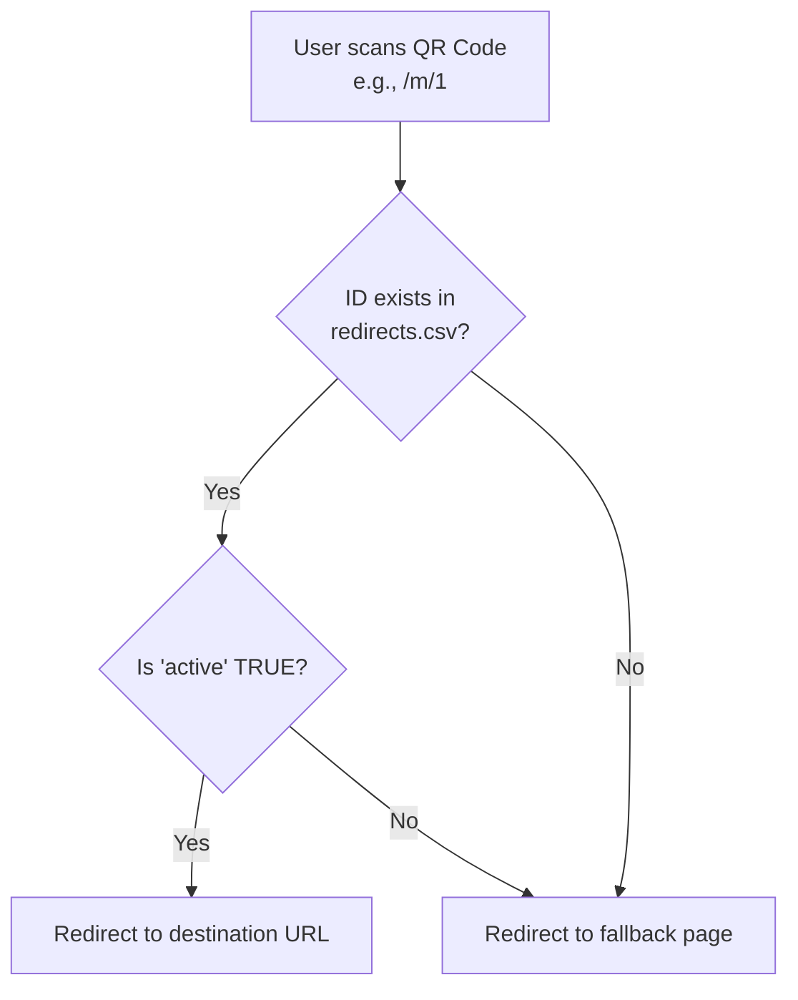

# QR Redirect

A Next.js application for managing and routing QR code scans for the Intelligent Systems Design Lab (ISD Lab).

Developed & maintained by **Harshil**.

## Overview

This project provides dynamic URL redirection based on QR code IDs. For example, a user scanning a QR code with the URL `https://qr.robofest.in/m/1` will be redirected to the URL associated with ID `1` in the database. 
If the ID is invalid or inactive, the user is redirected to a fallback page (e.g., `/m`).

### Flow Diagram



## Data Storage

The redirect data is stored in a CSV file located at `data/redirects.csv`. 

The CSV file has the following format:
```csv
id,name,designation,active,redirect
1,Harshil Malhotra,President,TRUE,https://harshilmalhotra.dev/
2,John Doe,Member,FALSE,https://example.com/
```
- `id`: The unique identifier in the QR code URL.
- `active`: Whether the redirect is currently active (`TRUE` or `FALSE`).
- `redirect`: The destination URL.
- Additional fields like `name` and `designation` can be stored for organizational purposes.

## Adding New Redirect Paths

Currently, the project uses the `/m/` path (e.g., `/m/[id]`). You can easily add new redirect paths like `/a/` or `/u/` by creating a new directory structure in the `app` folder.

To add a new path, for example `/a/`:
1. Create a folder `app/a/`.
2. (Optional) Create a fallback page `app/a/page.tsx` for invalid or missing IDs.
3. Create a dynamic route folder `app/a/[id]/`.
4. Create a `route.ts` file inside `app/a/[id]/`.

### Sample `route.ts` Code

Here is the sample code you can place in `app/a/[id]/route.ts`:

```typescript
import { NextRequest, NextResponse } from "next/server";
import fs from "fs/promises";
import path from "path";
import { parse } from "csv-parse/sync";

type Row = {
  id: string;
  active: string;
  redirect: string;
};

export async function GET(
  req: NextRequest,
  { params }: { params: Promise<{ id: string }> }
) {
  const { id } = await params;

  // Path to the CSV file
  const csvPath = path.join(process.cwd(), "data", "redirects.csv");

  const csv = await fs.readFile(csvPath, "utf8");

  // Parse CSV
  const rows = parse(csv, {
    columns: true,
    trim: true,
    skip_empty_lines: true,
  }) as Row[];

  // Find the matching active record
  const record = rows.find(
    (r) => r.id === id && r.active.toLowerCase() === "true"
  );

  // If not found or inactive, redirect to a fallback page
  if (!record || !record.redirect) {
    return NextResponse.redirect(new URL("/a", req.url)); // adjust fallback URL as needed
  }

  // Redirect to the destination
  return NextResponse.redirect(record.redirect);
}
```

## Running Locally

1. Install dependencies:
   ```bash
   npm install
   ```
2. Start the development server:
   ```bash
   npm run dev
   ```
3. Open [http://localhost:3000](http://localhost:3000) with your browser to see the result.
